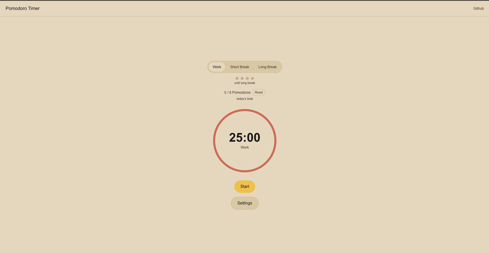

# Pomodoro Timer

A clean, focused Pomodoro timer built using React, Next.js, TypeScript, and Tailwind CSS.

**[Live Demo](https://pomodoro-timer-mylo4.vercel.app/)** · **[GitHub](https://github.com/shakibHossain/pomodoro-timer)**



## Features

- **Pomodoro timer** — work sessions, short breaks, long breaks
- **Session dots** — visual cycle progress, resets after long break
- **Daily goal tracking** — set a target, track total Pomodoros completed
- **Configurable settings** — customize all durations and cycle length
- **Browser notifications** — alerts when a session completes
- **Keyboard shortcuts** — Space (start/pause), R (reset), 1/2/3 (switch mode)
- **Persistent settings** — saved to localStorage, survives page refresh
- **Document title** — live countdown visible in the browser tab

## Tech Stack

| | |
|---|---|
| Framework | Next.js 14 (App Router) |
| Language | TypeScript |
| Styling | Tailwind CSS |
| State | useReducer + Context API |
| Testing | Vitest |
| Deployment | Vercel |

---

## Lighthouse scores

| Category | Score |
|---|---|
| Performance | 97 |
| Accessibility | 100 |
| Best Practices | 100 |
| SEO | 100 |

---

## Getting started

```bash
git clone https://github.com/your-username/pomodoro-app
cd pomodoro-app
npm install
npm run dev
```

Open [http://localhost:3000](http://localhost:3000)

---

## Running tests

```bash
npm test
```

---

## Keyboard shortcuts

| Key | Action |
|---|---|
| Space | Start / Pause / Resume |
| R | Reset current session |
| 1 | Switch to Work mode |
| 2 | Switch to Short Break |
| 3 | Switch to Long Break |

---

## V2 roadmap

- User auth (NextAuth.js)
- Session history dashboard with charts (Recharts)
- Backend persistence (Prisma + Postgres)
- Dark / light mode toggle
- Sound selection

